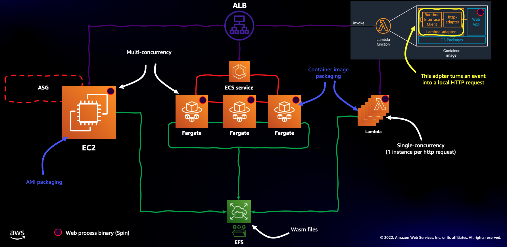
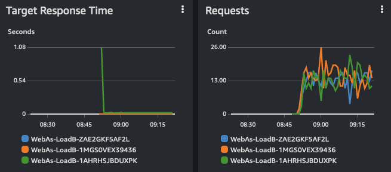
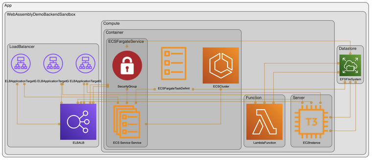

## Overview

This is a science project that aims to demonstrate how WebAssembly code can be run on different type of infrastructure compute primitives (namely instances, containers and functions). This experiment specifically leverages [Spin](https://github.com/fermyon/spin), "...a framework for building, deploying, and running fast, secure, and composable cloud microservices with WebAssembly." Note Spin is an open source project made available under the Apache-2.0 license. 

The inspiration for this PoC generated from [this GitHub discussion](https://github.com/fermyon/installer/issues/70). We are not going to debate here what the merits (or drawbacks) of running WebAssembly code and Spin specifically in each of the primitives considered. The goal was to demonstrate that it can be done (more or less elegantly). 

Note that this project focuses solely on demonstrating the possibility of running WASM artifacts across heterogeneous compute primitives, but you could use the same architecture to prove similar concepts for more traditional web services workloads that do not use WASM (just change the EC2 user data and the Dockerfile to accommodate your own generic web service).

## Architecture

The diagram below depicts, at the high level, the architecture that this project implements



The EC2 instance has a `user data` script that does the following: 
- it mounts an EFS Access Point (under `/mnt/app`) 
- it installs the Rust dev toolchain
- it installs `spin`
- it creates a new spin sample application (written in Rust) and build a wasm artifact (placed on the EFS Access Point)
- it launches the spin process to serve the sample application above

You can check the [user data script in the Infrastructure as Code](./backend/compute/infrastructure.py). If you want to change the application you can use this EC2 instance as your development environment. Just make sure you do everything in the `/mnt/app` folder because that is how the other primitives are going to leverage the same artifacts.

The [Dockerfile](./backend/compute/runtime/Dockerfile) that backs both the ECS/Fargate task and the Lambda function does similar things:
- it installs `spin`
- it launches the spin process to serve the sample application

Note that the Dockerfile embeds the [Lambda Adapter binary](https://github.com/awslabs/aws-lambda-web-adapter) to allow the container image to be re-used as-is in Lambda. Also note that both ECS/Fargate and the Lambda function will mount the same EFS Access Point (via the IaC) which will allow them to serve the same WebAssembly application created and built on the EC2 instance above.

## Output

Once the deployment is completed, CDK will output a load balancer endpoint. When you hit that endpoint you should receive a string (`Hello, Fermyon`) which is what the sample application returns. If you explore the setup you will notice that the LB is backed by 3 separate target groups one for each compute primitive configured (one EC2 instance, one ECS/Fargate service with a single task and one Lambda function). These compute objects are load balanced evenly. One easy way to check what happens is to solicit the endpoint with a loop. Something on the line of:
```aidl
while true; do curl http://<endpoint>; sleep 1; done
```
Note that, because the application always spit the same string, there is no easy way to tell which primitive is serving the request. However, if you move to the EC2 console -> Load Balancing -> Target Groups, you select the three target groups this project creates and go to the Monitoring tab, you will see Response Time and Requests metrics in meaningful format:



Note the cold start (1 second circa) for the Lambda at the first invocation. Subsequent requests are served while the Lambda is warm and are in the same ballpark as EC2 and ECS/Fargate. These two compute primitives do not have cold starts because they have resources (an instance and a container) always running irrespective of the requests.  

## Fun and interesting facts

Note how the actual WASM application is hosted on the EFS volume, and it's NOT baked into the AMI, user data or the Dockerfile (they only provide the runtime if you will, the spin framework in this case). This means that, in theory, an application version update could take the form of a new WASM file on the shared volume. This without having to redeploy the EC2 instance, the ECS/Fargate service or the Lambda. It's too bad that, for now, [Spin does not implement a hot reload functionality](https://github.com/fermyon/spin/issues/324).  

One of the interesting things about WebAssembly is that its artifacts are OS and CPU architecture agnostic. This means that you could add an EC2 instance or an ECS/Fargate task running Windows and the same WASM artifact on the EFS folder would work just fine (note you need to use the proper version of the [Spin binary](https://github.com/fermyon/spin/releases)). Similarly (and way more interestingly), you could add an EC2 instance, an ECS/Fargate task or a Lambda backed by a Graviton processor and the same WASM artifact on the EFS folder would work just fine (too bad in this case that [Spin binaries for Graviton/Arm are not yet available](https://github.com/fermyon/spin/issues/293)). 

## Getting started

This project is entirely defined using CDK v2 (and specifically using the Python language). See below for the detailed deployment instructions.

### Create development environment
See [Getting Started With the AWS CDK](https://docs.aws.amazon.com/cdk/latest/guide/getting_started.html)
for additional details and prerequisites

### Clone the code
```bash
git clone https://gitlab.aws.dev/mreferre/spin-wasm-multi-compute
cd spin-wasm-multi-compute
```

### Create Python virtual environment and install the dependencies
```bash
python3.7 -m venv .venv
source .venv/bin/activate

# [Optional] Needed to upgrade dependencies and cleanup unused packages
# Pinning pip-tools to 6.4.0 and pip to 21.3.1 due to
# https://github.com/jazzband/pip-tools/issues/1576
pip install pip-tools==6.4.0
pip install pip==21.3.1

./scripts/install-deps.sh
./scripts/run-tests.sh
```

### [Optional] Upgrade AWS CDK Toolkit (CLI) version
```bash
vi package.json  # Update the "aws-cdk" package version
./scripts/install-deps.sh
./scripts/run-tests.sh
```

### [Optional] Upgrade dependencies (ordered by constraints)
Consider [AWS CDK Toolkit (CLI)](https://docs.aws.amazon.com/cdk/latest/guide/reference.html#versioning) compatibility
when upgrading AWS CDK packages version.

```bash
pip-compile --upgrade requirements.in
pip-compile --upgrade requirements-dev.in
./scripts/install-deps.sh
# [Optional] Cleanup unused packages
pip-sync requirements.txt requirements-dev.txt
./scripts/run-tests.sh
```

### Deploy the component to sandbox environment
The `WebAssemblyDemoBackendSandbox` stack uses your default AWS account and region.

```bash
npx cdk deploy WebAssemblyDemoBackendSandbox
```

Example output for `npx cdk deploy WebAssemblyDemoBackendSandbox`:
```text
 ✅  WebAssemblyDemoBackendSandbox

Outputs:
WebAssemblyDemoBackendSandbox.LoadBalancerEndpoint = WebAs-LoadB-1FEU1R1742VAK-270357997.eu-west-1.elb.amazonaws.com
```

### Test the API
Below are examples that show the available resources and how to use them.

```bash
api_endpoint=$(aws cloudformation describe-stacks \
  --stack-name WebAssemblyDemoBackendSandbox \
  --query 'Stacks[*].Outputs[?OutputKey==`LoadBalancerEndpoint`].OutputValue' \
  --output text)

curl "${api_endpoint}"
```

### Visualize the components in the stacks

In addition to the hand-made diagram at the top, the [cdk-dia](https://github.com/pistazie/cdk-dia) tool is able to autogenerate an architectural diagram based on the IaC being authored:



### Delete all stacks
**Do not forget to delete the stacks to avoid unexpected charges**
```bash
npx cdk destroy WebAssemblyDemoBackendSandbox
```

### Credits and license

This repo is distributed under the MIT-0 license, and it's based on [this template](https://github.com/aws-samples/aws-cdk-project-structure-python).

Also, tons of credit to [Alex Pulver](https://github.com/alexpulver) who helped me out with all the CDK Python intricacies.